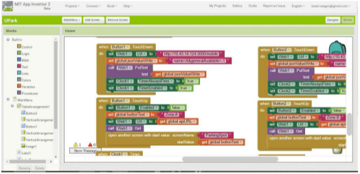
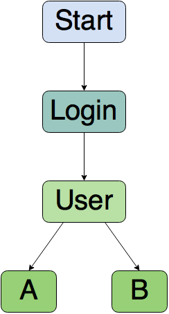

# Mobile-Application
The application was created with app inventor, that's why we don't have an actual source code, we have an image that shows our blocks code, which is here.

This is just a sample, we have other 6 images with the rest of the blocks code, all in this repository.

Here is a link to app inventor: http://ai2.appinventor.mit.edu/#5663367649296384

Repository for the Mobile App that will comunicate with the system.

This is the app that the users will be interacting with, it helps them see which parking areas have free spaces and which of them don't. The users will be able to book a parking spot inside the parking lot, scpecifically in an area of the parking lot.

There are multiple areas in the parking lot, the parking lot can grow, and have new areas, this areas will be displayed correctly in the application.

Methods:

MainMenu.OtherScreenClosed: When the main menu window is created, the api information is obtained through an url directed to the server. The JSON obtained from the url is decrypted, the information is stored in a list; this list contains other lists with the values of the variables of each area (maximumCapacities and freeSpaces). Then the method checks the number of free spaces and, if there are ore there are not, the area buttons are activated or deactivaded respectively.

Boton.TouchDown: When the button is pressed, it sends some information, simulating that a car has entered a parking area, this information is identified as sent by the Mobile Application, because of that, after a minute the space that has been claimed as occupied is freed, this unless the app user gets into the area.

Boton.TouchUp: When you stop touching the button in the app, a new window opens, it notifies you that now you can park in the specified area. Then it passes the name of the area as a parameter to a new window that'll be created. It makes a call to create the new window. 

ParkingSpot.Initialize: Receives the name of a determined area, obtained from the Boton.TouchUp method, then it displays it on screen.

